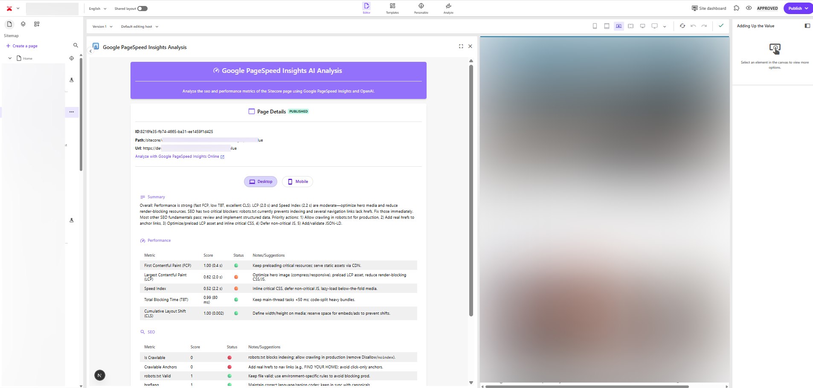

# Google PageSpeed Inights Analysis

A Sitecore Marketplace App to analyze Google PageSpeed Insights for the current page in Page builder.
It uses OpenAI APIs to generate clear recommendations for further `Performance` and `SEO` improvements.



## ✨ Features

- ✅ Validate if the current item is published to Edge.
- 🔗 Provide the published URL of the context page.
- 📊 Analyze Google PageSpeed Insights metrics for `Performance` and `SEO` on both **Desktop** and **Mobile**, with insights enhanced by OpenAI GPT-5. The analysis is structured into three sections: Summary, Performance, and SEO.
- 🌐 Generate a direct link to the Google PageSpeed Insights online report for deeper analysis.

## 🚀Setup Instructions

### 1. Install Dependencies

```bash
npm install
```

### 2. Create .env

Create .env file in the project root and provide the required API keys:
- https://developers.google.com/speed/docs/insights/v5/get-started
- https://platform.openai.com/api-keys

```
PAGESPEED_API_KEY=
OPENAI_API_KEY=
```

### 3. Development

Run the development server:

```bash
npm run dev
```

The app will be available at 👉 `http://localhost:3000`

### 4. Building for Production

```bash
npm run build
npm start
```

## 🛠️ Marketplace Deployment

- This app is configured to run at a **Page context panel** in Page builder.
- The location of the icon is at `http://localhost:3000/icon.png`

## 📄License

This project is licensed under the MIT License.
